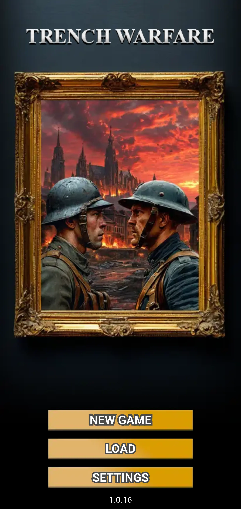
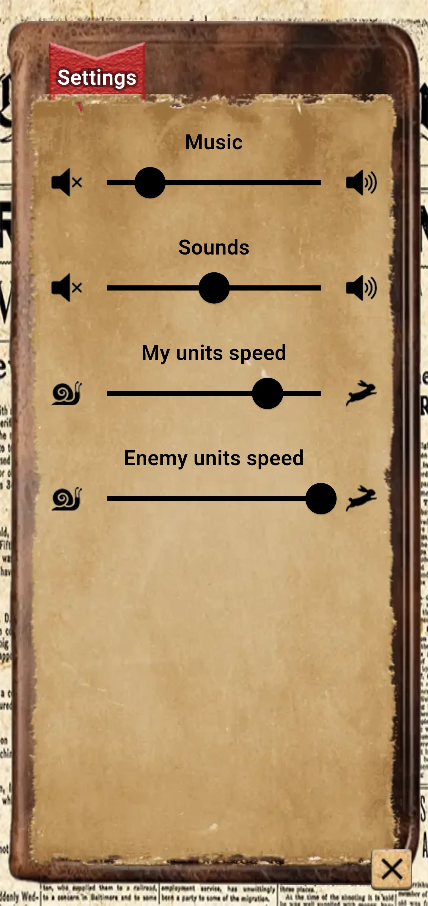
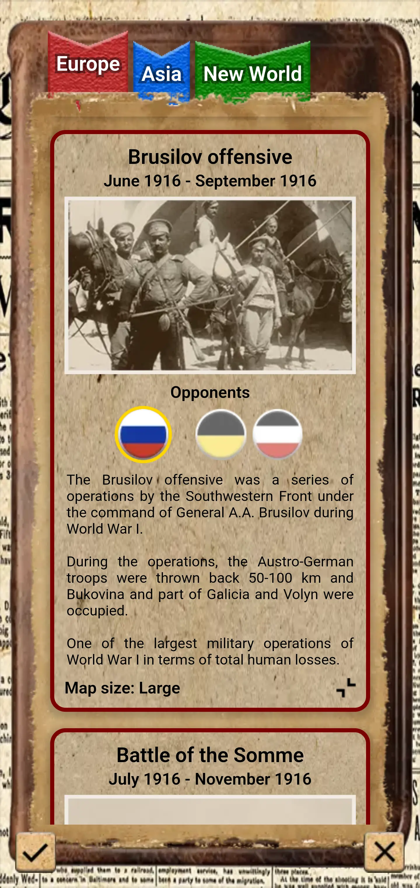
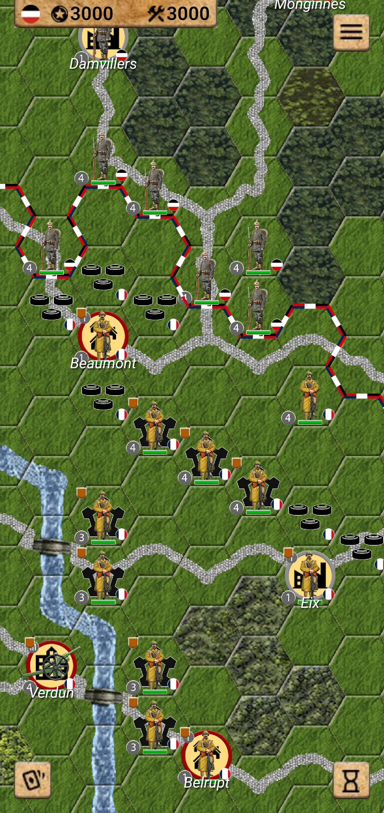
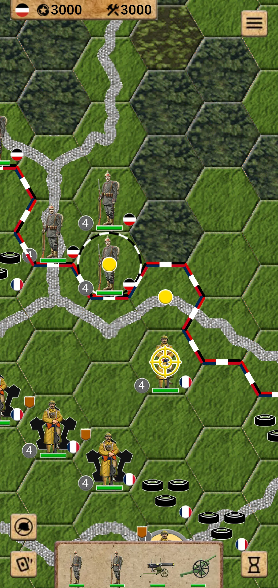
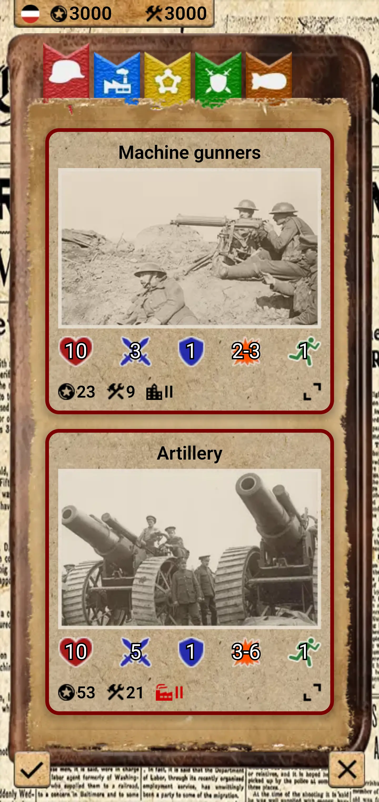
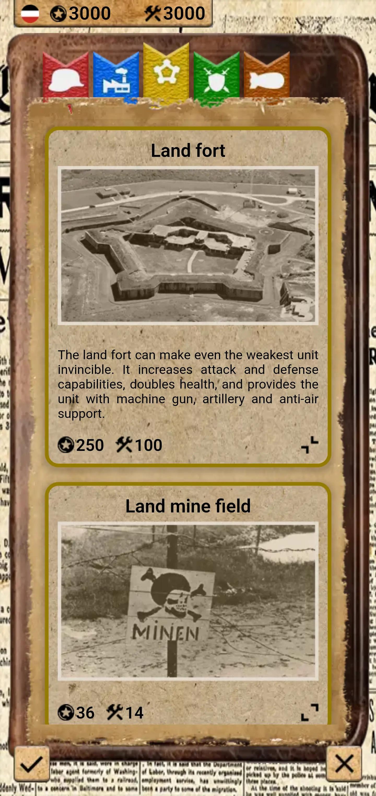
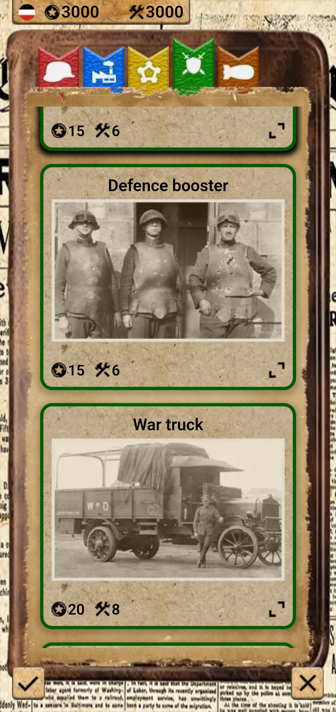
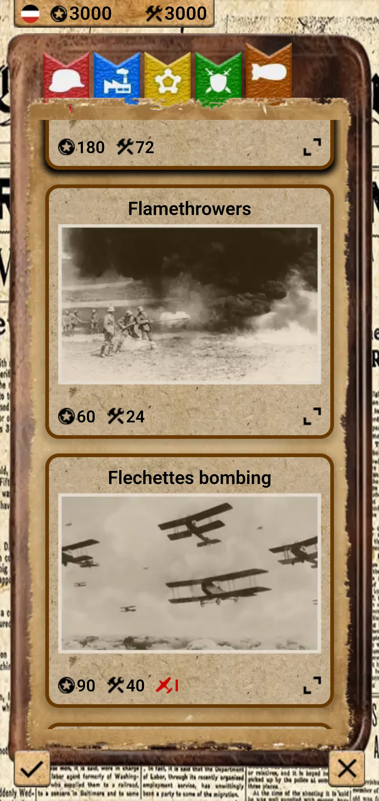

# Trench Warfare

Trench Warfare is a full-fledged turn-based strategy game set in WWI. It is written in Flutter using the Flame game engine.

Here are some screenshots from the game.

||||
|---|---|---|
||||
||||
||||